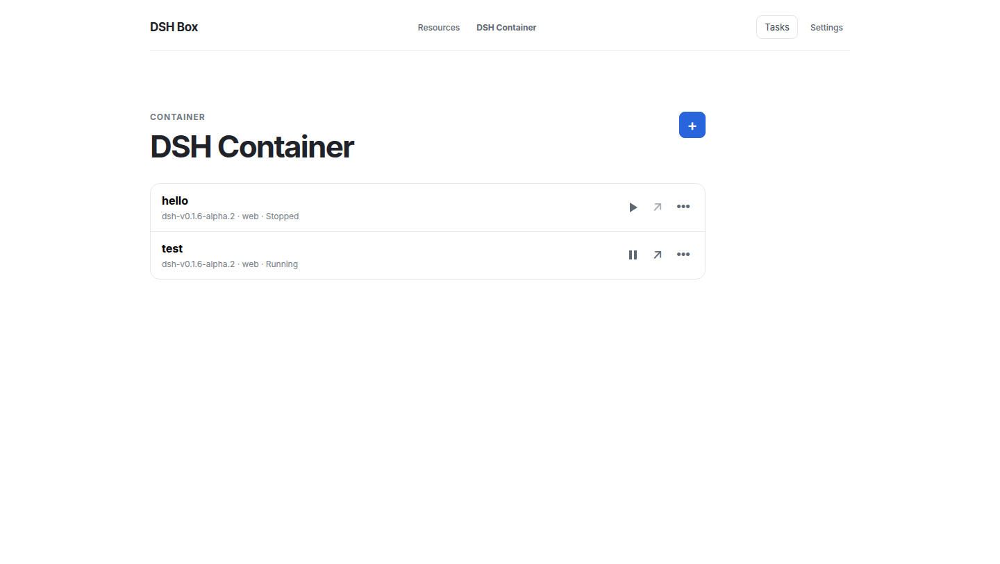
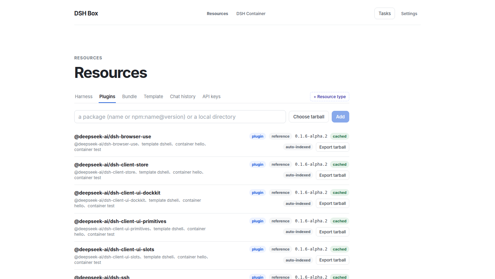
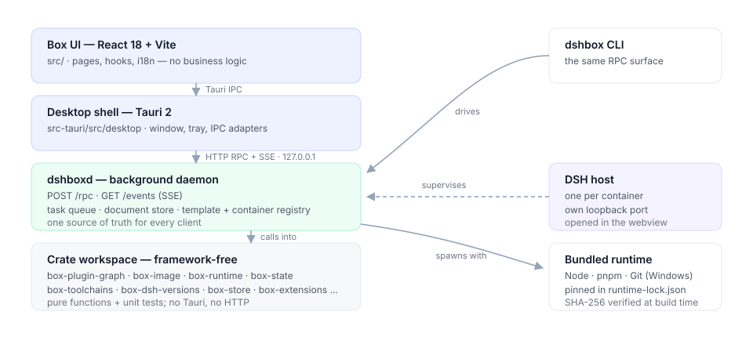
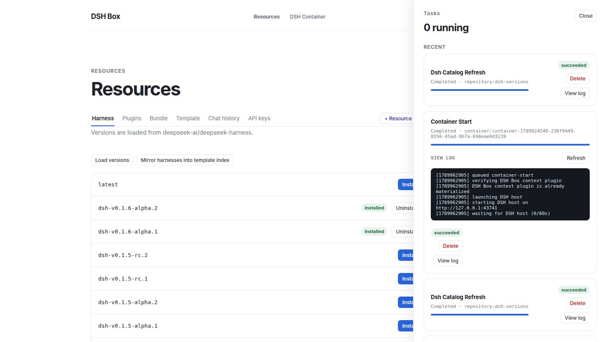
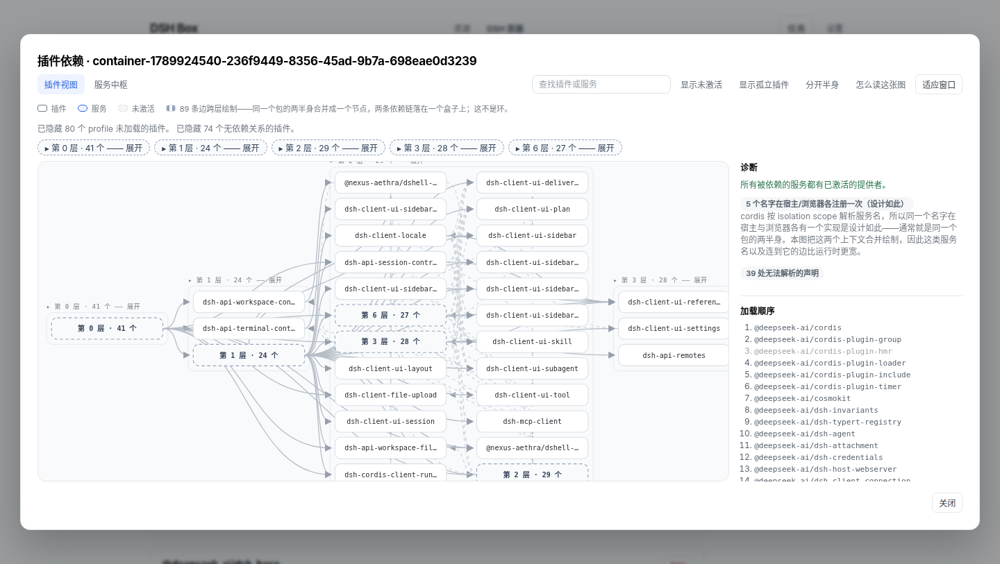
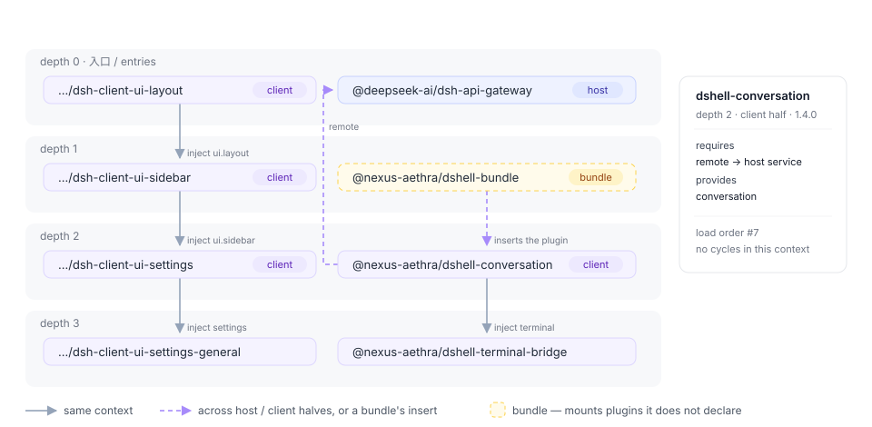
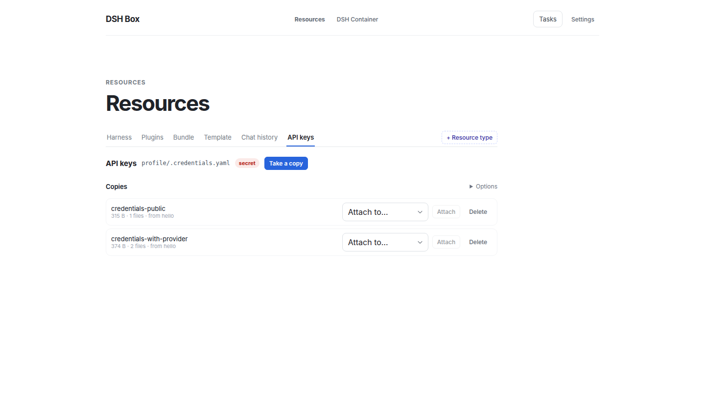
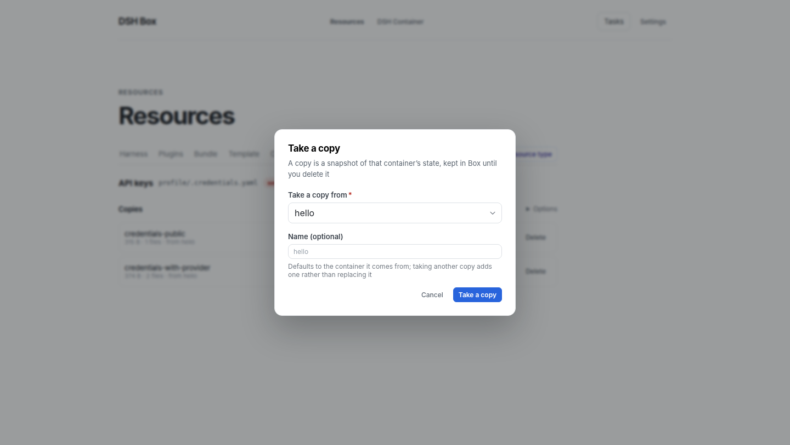
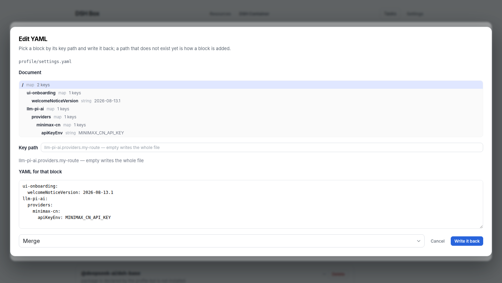

# DSH Box

**English** · [简体中文](README.zh-CN.md)

**Managed DeepSeek Harness desktop runtime** — run, isolate, and extend multiple DeepSeek Harness environments on your own machine, no browser tab required.

DSH Box is a lightweight desktop shell built with [Tauri 2](https://tauri.app) that installs, launches, and manages independent DSH **Containers** — each with its own DSH version, profile, plugins, skills, workspace, and logs — and renders them in an embedded WebView.



## Highlights

- **Isolated containers** — one DSH version, profile, workspace and host process each.
- **Embedded WebView** — the DSH UI opens in a native window; no ports, no URLs to paste.
- **Ready in seconds** — a pulled Harness version arrives with its client artifacts built; `run` is a copy (~10s).
- **Plugin dependency graph** — what loads, in what order, why: depth bands, halves apart, fold a depth away.
- **Resources: extract, inject, edit** — conversations, keys and plugin state as named copies; any YAML block editable by key path.
- **An agent surface** — `dshbox apply -f` configures resources from one document; every verb answers `--json`.
- **Zero-dependency install** — bundled Node, npm, pnpm and Git (Windows), in a clean room.
- **Version manager** — install any Harness tag and pin a version per container.
- **Boxfiles** — `FROM` + `ADD` describes a template; build once, run many.
- **Portable templates** — every payload is materialised into the template, so containers depend on nothing mutable.
- **Bundles** — group plugins and skills, then export quick (URLs kept) or full (one archive).
- **Tasks you can watch** — queued, logged with timings, cancellable, with history.
- **A slow daemon never freezes the window** — commands run off the main thread and every RPC is bounded.
- **RPC + events** — one `POST /rpc` and one SSE stream serve the UI, the CLI and agents alike.
- **Network-friendly** — GitHub mirror, npm registry mirror, automatic proxy detection.
- **Tray and background service** — `dshboxd` keeps working with the window closed.
- **Lightweight** — Tauri, not Electron.
- **Bilingual UI** — English and 简体中文.



---

## Install

Download the installer for your platform from the **Releases** page of this repository:

| Platform | Artifact | Notes |
|---|---|---|
| Windows (x64) | `dshbox_<version>_x64_<locale>.msi` | MSI installer with bundled runtime and sidecar |
| Linux (x64) | `dshbox-<version>-amd64.deb` | Debian/Ubuntu package |
| macOS (arm64) | `dshbox-<version>-arm64.dmg` | Apple Silicon |

> Grab the latest version from the [Releases page](https://github.com/Nexus-Aethra/DSHBox/releases) — artifact names follow the `<product>-<version>-<arch>` convention. Every tagged release carries all three platforms, built by the [release workflow](.github/workflows/release.yml).

No runtime prerequisites on Windows — the bundled Node/npm/pnpm/Git runtime travels inside the installer. Linux needs a system Git (`apt install git` or your distro equivalent); its configuration is isolated per-runtime-directory, so your host `~/.gitconfig` is never read by DSH Box builds.

---

## Quick start

1. **Launch DSH Box** and pick a writable *runtime directory* when prompted (all DSH data lives there).
2. Open **Resources** → **DSH Versions** → **Load versions**, then install the DSH tag you want.
3. Open **Resources** → **Templates**, then pull an official DSH template or build a reusable template from a Boxfile.
4. Open **Container** → create a Container from that template (name and profile).
5. The first create prepares the Container in its final directory (offline dependency install, local plugins, frontend build). Press **Start** — DSH Box launches that prepared copy and opens the DSH UI in the embedded WebView.
6. Use **Resources** to import plugins/skills, assemble bundles, or create Boxfiles for reusable plugin-enabled templates.

### Tray

The app minimizes to the system tray on close. Use the tray menu to open the window or start/stop/restart the `dshboxd` background service.

---

## Architecture

DSH Box separates a Tauri **desktop shell**, a framework-free Rust workspace, a background **daemon** (`dshboxd`), and a small React frontend. The split exists so all business logic — plugin fetching, container lifecycle, template resolution, background tasks — is testable without a UI, and so a CLI or external agent can drive the same flows the UI does.



### Layered components

| Layer | What lives here | Why |
|---|---|---|
| Frontend (React 18 + Vite, `src/`) | Pages, components, `useTaskQueue`/`useContainers`/`useResources`/`useSettings` hooks. **No business logic** — pages fire RPC requests and react to daemon SSE events. | Keeps the Box UI thin and lets any client (UI/CLI/agent) share the same code path. |
| Desktop shell (Tauri 2, `src-tauri/src/`) | Browser window, tray, Tauri IPC adapters. Listens on `127.0.0.1` to the daemon's loopback HTTP server. All real work is delegated to `dshboxd` over HTTP RPC. | One source of truth for state changes — UI and CLI cannot drift. |
| Daemon (`src-tauri/crates/dshboxd`) | Long-lived background service. Owns the queue, the data store, the template index, container registry, and the SSE event bus. Single HTTP entry point (`POST /rpc`) plus `GET /events?token=…`. | Background work (installs, rebuilds, uninstalls) survives the desktop window closing. |
| Crate workspace (`src-tauri/crates/`) | Framework-free Rust crates: `box-foundation`, `box-runtime`, `box-scheduler`, `box-state`, `box-toolchains`, `box-dsh-versions`, `box-containers`, `box-extensions`, `box-image`, `box-template-core`, `box-data-scheduler`, `box-logger`, `box-dsh-context`, `box-server-core`, `box-api`, `box-client`. | Pure functions + unit tests; only the top-level `dshbox` binary and `dshboxd` link Tauri/HTTP. |

The dependency direction is one-way: `foundation / runtime / scheduler / state` → functional crates → Tauri/desktop adapters. Feature crates do not depend on Tauri or one another's mutable state.

### Daemon — dual-mode RPC + SSE event stream

Every UI / CLI action lands on `POST /rpc` with a JSON body of `{"method": "...", "params": {...}, "token": "..."}`. The daemon's dispatch table decides for each handler whether to **synchronously** return JSON (`List templates`, `Read settings`, …) or **asynchronously** enqueue a worker (`Install`, `Build`, `Start container`, `Rebuild`, `Uninstall`, …). Async handlers return a `TaskRecord` immediately; the client subscribes to `GET /events?token=…` for `task_stage` / `task_log` / `task_finished` / `resource_added|updated|removed` events. The daemon threads one connection per request, so a long task never blocks the liveness probe.

This means the same HTTP surface serves every consumer — the desktop app's Tauri IPC handlers, the CLI (`dshbox rpc …`), and external agents calling `curl -d '…' http://127.0.0.1:7923/rpc`. There is no "client fallback" or local-state divergence: the daemon's resource map and task queue are the only sources of truth.

A task's log file is the UI's only window into it: the daemon writes it, the desktop streams the lines into the panel, and a step the user waits minutes for says what it is doing and how long it took.



### Boxfile and the built-template pipeline

A **boxfile** (`.dsh`) is the declarative script that describes a Container you want to instantiate. `dshbox build` resolves it into a **sealed template recipe**: physical Harness source without `node_modules`, plus the profile, local plugin artifacts, skills, and data needed by its `ADD` directives — including the client artifacts the prepared base already built. `dshbox run <template>` copies it to the final Container directory and links its dependencies offline; later starts do none of those steps.

The full grammar is in [`docs/template-system.md`](docs/template-system.md); the canonical reference example (every source shape) is in [`examples/boxfile-plugin-chains.dsh`](examples/boxfile-plugin-chains.dsh). Here is the minimal form:

```text
FROM github.com/deepseek-ai/deepseek-harness:latest
PROFILE web
NAME my-team

ADD plugin github.com/owner/cordis-plugin-foo:1.2.3
ADD plugin npm:@linxin666/dsh-web-ui-all
ADD plugin ./plugins/secret
ADD skill team-conventions
```

| Directive | Required | Notes |
|---|---|---|
| `FROM <ref>` | yes (exactly once) | GitHub short form (`github.com/owner/repo[:tag|@ref]`), or a local template name (e.g. `web-base`). Up to four levels of template inheritance. |
| `PROFILE <name>` | yes (exactly once) | Target DSH profile (`web`, `headless`, …). |
| `NAME <image-name>` | no | Defaults to the script file's stem. |
| `VERSION <image-version>` | no | Defaults to `latest`. |
| `LABEL key=value` | repeatable | Free-form metadata attached to the built template. |
| `DEF <name> @<path>` | repeatable | Defines a path alias usable as `@<name>` in subsequent `ADD` lines. |
| `ADD plugin\|skill\|data <src> [@<dest>]` | one or more | Resource you want baked into every Container made from this template. |
| `CP <src> [@<dest>]` | alias for `ADD plugin` | Kept for backward compatibility. |

`<src>` accepts four shapes:
1. **GitHub short form** — `github.com/owner/repo[:tag|@ref]`. The GitHub branch resolves through `pnpm pack` and the same fetching/import pipeline as npm; a tagged release becomes a `ref_` on `ParsedSource::Github`.
2. **Tarball** — `https://…/pkg.tgz`, `./relative.tgz`, `/abs/path.tgz`. Anything fetched and unpacked as a tarball.
3. **Local directory** — `./plugins/foo` / `/abs/path/foo`. Imported directly (no archive round-trip) — useful for plugins in progress.
4. **Bare name** — `name[@version]` or `@scope/name[@version]` for plugins already in the Repository.
5. **Explicit prefixes** — `git:…` (clones via libgit2, no guessing) and `npm:…` (registry spec forwarded to pnpm).

The `:latest` tag and the explicit `latest` keyword are interchangeable; both pin the harness repository's main branch.

How each `ADD` is stored matters:
- `ADD plugin` — the source is imported into the shared **Repository** as an immutable local `artifact.tgz`, recorded by the sealed recipe, then added only while preparing a Container at its final path. No running Container has an absolute repository path or runs a plugin dependency install.
- `ADD skill` and `ADD data` — snapshotted into the data store (`<runtime>/data/<digest>/`), materialised in the built template, and copied into the Container profile.
- The bundled `dsh-box-context` plugin (`@deepseek-ai/dsh-box-context`) is copied automatically — you do not need to `ADD` it.

`dshbox build` writes a digest-addressed sealed template. `dshbox run <name>` then:
1. Resolves the template's `FROM` chain (max depth 4),
2. Creates `<runtime>/instances/<id>/{profile,workspace,state,logs}`,
3. Copies the template's materialised plugins/skills/data into the profile,
4. Allocates a loopback port immediately before host spawn,
5. Launches bundled `pnpm dsh web` from the Container's Harness copy and waits for readiness,
6. Writes `paths.dshboxHome` + `paths.dshboxCli` into the snapshot so the in-container agent can find the CLI.

Where the work happens is deliberate:

| Step | What it does | Cost |
|---|---|---|
| `dshbox pull template` | clones the Harness commit, installs its dependencies **and builds the client artifacts** (native addon, host/client libraries, web frontend) into a prepared base, recording the revision and platform they were built for | once per Harness version, per platform |
| `dshbox build` | copies that base — artifacts included — and installs the profile's plugins into a sealed template | once per template |
| `dshbox run` | copies the sealed tree, links dependencies from the pnpm store, materialises Box's context plugin, starts the host | **~10s** per container |

A base that predates this is repaired in place the first time a template is built from it, and a template carrying no artifacts for this commit and platform (an old one, or one imported from another OS) is rebuilt at container creation instead — the task log says which path was taken. The full storage, transaction, and migration contract is in [`docs/specs/prepared-template-runtime.md`](docs/specs/prepared-template-runtime.md). This is a schema break: legacy shared `runtimes/<version>/source` layouts are not used by new builds.

### Plugin dependency graph

`plugin_dependency_graph` answers "what loads, in what order, and why" for a sealed template, a container directory, or a running host. The daemon walks the package tree, scans each package's sources, and returns nodes, links, layer depths, load order, shared services, and diagnostics. The **Dependency graph** button on a template (Resources → Template) and on a container's detail view renders it.



The drawing above is the real thing; the figure below names what it is made of — bands, halves, the dashed cross-context edge, and the pending member of a cycle.



What it computes:

- **A node per mounted plugin, not per package.** A package that ships both a host and a browser half (`dsh.client` + `exports["./client"]`) becomes two nodes, so `inject`/`provide` resolve inside one context. A name provided once per context is a shared service, not a conflict — which also means a cycle is either inside one context or it is real.
- **Only registered declarations count.** An `inject` is read where a plugin registers it: an `Object.assign(target, { inject })` carrier, or a factory's returned `{ inject, apply }`. A plain object property is not a plugin declaration; treating one as such invented 26 requirements on a real profile.
- **The launcher is a provider too.** `apps/cli` builds the root context and hands services to the plugins it mounts, so it is scanned and drawn as `dsh (launcher)` — without it, every plugin that injects `profileContext` reads as waiting on nobody.
- **Depth bands, load order, and folding.** A node's depth is one more than the deepest dependency it injects (0 = has nothing to wait for), and within a band nodes are ordered by how many plugins depend on them. A depth too big for one band is **folded on open** — a 175-node container reads as 31 boxes — and a band's label or its summary box folds and unfolds it: the layer's edges re-point at the summary, the rest of the diagram reflows, and the folded depth stays as a chip above the canvas. A cycle does not hide the order: the nodes still inside it are marked pending.
- **A cycle is a graph fact; a crossing is a drawing fact.** Red dashed means "on a cycle, this cannot load", decided on the half-preserving links and inside one context. An edge the drawing merely cannot lay out forwards — the default view merges a package's two halves into one box, so `host A → B` sits beside `browser B → A` — is a quiet grey dash with a legend line saying so. Splitting the halves leaves zero crossings, which is the check that the layering is right.
- **What a working container contradicts is a bug in the scanner.** An incomplete static view must not claim a service is missing, a provider is inactive, or two registrations in different contexts conflict; the launcher, the halves of a package, and the isolation scopes each took one of those false alarms out.
- **Bundles are followed.** A bundle's `cordis.patch.yml` `insert` rows are read, so the plugins a bundle mounts appear as the nodes they are — including the ones a Boxfile `ADD`s, which is what makes a template preview show its own plugins before any container exists.
- **Diagnostics name their file.** Anything the scanner cannot resolve is reported with the package and the file it came from, in a collapsible panel, instead of being dropped without a trace.
- **Published packages are read where their code is.** The client entry from the manifest's `dsh.client`/`exports` subpath — as a prefix list, because a package ships `lib/client.js` *and* `lib/client/` — `lib/` when there is no `src/`, and never a build output directory.

The scan is text-based on purpose — a small scanner over comment-blanked sources, not a TypeScript AST: the graph has to describe a container's `node_modules` without loading DSH, and a wrong node must be cheap to spot and correct.

### Container resources

A container persists state that is not code: conversations under `profile/sessions/<workspace>/session-<id>/`, provider keys in `profile/.credentials.yaml`, and whatever a plugin writes under its own directory. Box models each of those as a **kind** — a location, whether it holds secrets, and how deep its independent entries sit — and two verbs move it.

A kind is **one or more parts**, and a part is either a whole path or **one key path inside a YAML document**. The second shape exists because DSH splits some state across files: a provider key is a ref in `.credentials.yaml`, while the route that names the environment variable holding it lives in `settings.yaml` under `llm-pi-ai.providers.<route>.apiKeyEnv` — the rest of which belongs to other plugins. So the `credentials` kind carries both, extracted into one payload and merged back deeply, and a key arrives *with* the provider that uses it.

- **Extract** copies a kind (or one entry, so a single conversation can travel) into `<runtime>/resources/<id>/payload/`, digests it, and records it in the shared document store. `--out file.tar.gz` also packs it for another machine.
- **Inject** writes it back from the store, straight from another container, or from a tarball. `Refuse` is the default and checks every clash before writing anything; `Merge` replaces only what the payload carries and deep-merges YAML maps; `Overwrite` replaces the value first. A file a secret kind writes is tightened to `0600` on the way in and out, and a running container is refused unless `--restart` asks for stop → inject → start.
- **A copy has a name.** It is the user's, the selected entry's, or the source container's; taking a copy again adds `<name>-2` rather than replacing the one already there, because taking a copy is an explicit act — the same kind from two containers must not land on one row.

Kinds come from three places: Box ships `sessions` and `credentials`; a plugin package can declare its own in `dshbox.resources`; and when a plugin declares nothing, Box reads the `join(root, 'a', 'b')` chains in its shipped code and offers those paths as candidates — never as trusted paths. That is what the Resources panel shows: pick a plugin, see whether it persists anything, where, and how much.



In the UI, a resource type is a **tab in the Resources navigation**. `Chat history` and `API keys` ship as tabs, and **+ Resource type** adds one more: pick a container, then either a kind Box detected there, a **plugin to scan** (every package installed in the profile is offered, filtered as you type), or a path you pick in a **tree of the container's storage area**. Taking a copy is one button that opens a card — which container the state comes out of, and what to call the copy:



Any YAML block of a container file can be edited by its key path, in the same model: the document is a tree, picking a node loads that block, and a path that does not exist yet is how a block is added. Writing goes through the same merge-or-replace policy an injected copy uses.



```bash
dshbox container resource list <id> [--plugin @scope/name]      # kinds, locations, sizes
dshbox container resource types [--json]                        # resource types (UI tabs)
dshbox container resource extract <id> credentials --name prod
dshbox container resource stored                                # what the Box store holds
dshbox container resource inject <id> credentials-prod --merge --restart
dshbox container resource inject <id> --from <other-container> --kind sessions
dshbox container resource read <id> profile/settings.yaml --section llm-pi-ai
dshbox container resource write <id> profile/settings.yaml --section llm-pi-ai.providers.acme \
  --text 'apiKeyEnv: ACME_API_KEY' --merge
```

### Driving it from an agent

The CLI is the agent surface and the UI is the human one, so the verbs an agent needs are non-interactive and machine-readable.

`dshbox apply -f <file>` takes one document and makes the resource layer match it:

```yaml
container: test                 # default container for the entries below
types:                          # resource types to register (the UI's tabs)
  - label: ACME state
    kind: path
    path: profile/plugins/acme/state
copies:                         # state to extract into the store
  - name: before-upgrade
    kind: credentials
    from: test
```

Applying is idempotent — a type is keyed by kind + container + path, and a copy whose name is already in the store reports `exists` — `--dry-run` changes nothing, `--json` reports per entry, and an unknown key is an error rather than a silent no-op. Reading is machine-readable too:

```bash
dshbox apply -f resources.yaml --dry-run
dshbox apply -f resources.yaml --json
dshbox container resource list <id> --json
dshbox container resource read <id> profile/settings.yaml --json
```

`dshbox help`, `dshbox container resource help`, and `dshbox apply help` describe every verb without needing the UI.

### Persistence and reference counts

Long-lived indexes are stored as documents instead of scattered files: the task queue goes through `box_foundation::collection::DocumentStore` — SQLite, via the `box-store` crate, at `<runtime>/state/dshbox.db` — so the daemon and the desktop app share one queue without either owning a file. Legacy task JSON is imported on first open and archived as `*.pre-sqlite`, and schema changes are forward-only migrations gated by `PRAGMA user_version`. Content-addressed directories (`templates/<hash>/`, `data/<digest>/`, `runtimes/`) stay on disk, and `config.json` stays machine-local in `~/.dsh-box/` — it never enters the store.

Containers, templates, plugins and skills are referenced by id, and deletion is `soft-delete → fast queue → permanent delete`, so an entity still in use is never garbage-collected. Full design in [`docs/specs/data-scheduler.md`](docs/specs/data-scheduler.md).

### Logging

`tracing` + `tracing-subscriber` ship structured logs to `<runtime>/logs/<component>.log` (daily rolled) and mirror to stderr. Filter with `RUST_LOG`, e.g. `RUST_LOG=info,dshboxd=debug,box_template_core=debug`.

---

## Technology

| Layer | Stack |
|---|---|
| Desktop shell | Tauri 2, Rust (Cargo workspace under `src-tauri/`) |
| UI | React 18, TypeScript, Vite |
| Background service | `dshboxd` sidecar (single HTTP entry: `POST /rpc` + `GET /events`) |
| Bundled runtime | Node / npm / pnpm / Git-Windows-only (per-platform archive, SHA-256-pinned in `runtime-lock.json`) |
| Targets | Windows x64 (MSI), Linux x64 (deb, rpm), macOS arm64 (dmg) — all built by the release workflow |

---

## Building from source

Prerequisites: [Node.js](https://nodejs.org) 22.13+ with pnpm (the pinned `packageManager` needs `node:sqlite`), the [Tauri 2 prerequisites](https://v2.tauri.app/start/prerequisites/) for your platform, and **7-Zip** (needed once by `runtime:prepare` to unpack the Windows PortableGit archive — install from [7-zip.org](https://www.7-zip.org/) or `apt install p7zip-full`, and make sure `7z` is on `PATH`). 7-Zip is a build-time-only tool; it never ships in the installer.

```bash
pnpm install
pnpm runtime:prepare    # fetch + verify + extract the bundled Node/pnpm/Git runtime
pnpm server:prepare     # build the dshboxd sidecar
pnpm tauri dev          # run in development
```

`runtime:prepare` verifies every archive against the SHA-256 pins in `runtime-lock.json` before extraction and aborts on mismatch. If 7-Zip is missing the Git step is skipped with a warning (Node/pnpm still prepare); re-run after installing it.

Release bundles (per platform):

```bash
pnpm bundle:windows     # Windows MSI installer
pnpm bundle:linux       # Linux .deb
pnpm bundle:macos       # macOS .dmg
```

Run the test suite:

```bash
cd src-tauri && cargo test --workspace
```

---

## Releasing

The version lives in three files and they must agree — `package.json`, `src-tauri/tauri.conf.json`, and `src-tauri/Cargo.toml`. Bump all three, record what changed in [`CHANGELOG.md`](CHANGELOG.md), then tag:

```bash
git tag v0.1.8 && git push origin v0.1.8
```

[`.github/workflows/release.yml`](.github/workflows/release.yml) takes it from there: it builds the Linux `.deb` + `.rpm`, the Windows MSI, and the macOS arm64 `.dmg` through the same `bundle:*` scripts a developer runs locally, and attaches all of them to the GitHub Release for that tag. The tag is compared against the three version fields first, so a mismatched tag fails instead of publishing mislabelled installers; if a release for the tag already exists, the artifacts are re-uploaded over it. Running the workflow manually (`workflow_dispatch`) builds everything without publishing, which is the way to test a pipeline change.

Installers are **unsigned**: macOS needs the usual Gatekeeper bypass on first launch and Windows shows a SmartScreen prompt. Signing and notarization identities can be added to the workflow when certificates are available.

---

## Repository layout

```
src/                       React/TypeScript management UI
src-tauri/                 Rust workspace + Tauri shell
  crates/                  focused, framework-free crates
    box-foundation         config, paths, document collections
    box-store              SQLite document store + legacy import
    box-runtime            absolute-path process exec
    box-scheduler          persisted task queue + locks
    box-state              ResourceStateManager (read model)
    box-toolchains         bundled Node/pnpm resolver
    box-dsh-versions       DSH GitHub catalogue (harness tag + installs)
    box-containers         Container metadata + active Host registry
    box-extensions         repository plugin/skill scan + transfer
    box-image              .dsh parser, manifest v6, gzip tar I/O
    box-plugin-graph       plugin dependency scan + graph assembly
    box-resources          resource kinds, extraction and injection
    box-template-core      root/common template install/uninstall core
    box-data-scheduler     soft-delete + dual-queue async hard-delete
    box-logger             tracing init + daily-rolled log files
    box-dsh-context        dsh-box-context plugin (paths.dshboxHome/dshboxCli)
    box-server-core        dshboxd helpers + service install
    box-api, box-client    RPC surface + client adapter
  src/desktop/app/         domain modules (containers, extensions, tasks, …)
  tools/runtime-packager   bundled Node/pnpm/Git runtime packager
examples/                  boxfile.dsh + plugin-chains example
docs/                      HANDOFF.md, template-system.md, specs/, design/,
                           notes/, images/
.github/workflows/         release.yml — a v* tag builds the three installers
```

The canonical reference for the boxfile grammar is **`docs/template-system.md`**; image/built-template design lives in **`docs/specs/image-build.md`**; the full RPC + event-stream surface in **`docs/design/rpc-and-events.md`**.

---

## License

Proprietary — see repository owner for licensing terms.

© Nexus-Aethra
